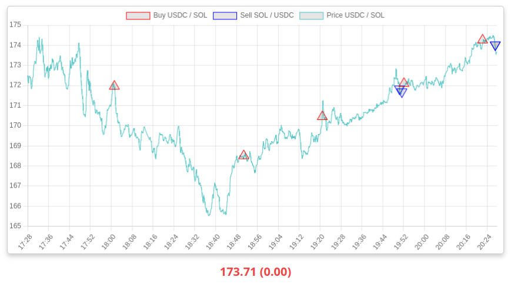

# Solana Trader

<p align="center">
    
</p>

<hr />

## Overview

This project is a trading service that allows you to trade on the Jupiter DEX
using the Solana blockchain. The main trading direction supported by this
project is from **USDC to other tokens**.

## Features

<p align="center">
    
</p>

<hr />

- Auto trade between USDC and various tokens on the Jupiter DEX.
- Analyze market conditions using technical indicators such as
EMA (Exponentia
l Moving Average) and RSI (Relative Strength Index).
- Monitor open orders and perform transactions.

## Installation

1. Clone the repository:

   ```bash
   git clone https://github.com/alexmudrak/solana_trader
   ```

2. Navigate to the project directory:

   ```bash
   cd trading-service
   ```

3. Run docker container:

   ```bash
   docker-compose up --build
   ```

4. Navigate to UI

   ```
   http://localhost:8000
   ```

## Usage

1. For first ADD USDC token at `http://localhost:8000/add-token` and other one.
2. Create and select a trading pair `http://localhost:8000/create-pair`.
2. Setup trading settings and check if enable auto buy/sell.
4. Enjoy it.

## Warning

**This project is for educational purposes only.** It does not guarantee
profit from trading activities. Please do your own research and be aware
of the risks involved in trading cryptocurrencies.

## License

This project is licensed under the MIT License - see the [LICENSE](LICENSE)
file for details.

## Tech stack

| Backend | Frontend |
|---------|----------|
| FastAPI | HTMX |
| SqlLite | JavaScript |

Enjoy ;)
